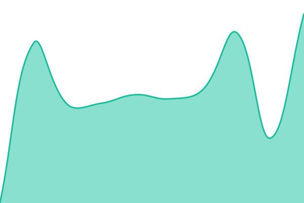

# [📈 实时状态](https://nijicollage.xyz/category/%e5%89%a5%e3%81%8e%e3%82%b3%e3%83%a9/): <！ -实时状态- > **所有系统都可以正常运行**

This repository contains the open-source uptime monitor and status page for [jianyuyanyu](https://nijicollage.xyz/category/%e5%89%a5%e3%81%8e%e3%82%b3%e3%83%a9/), powered by [Upptime](https://github.com/upptime/upptime).

With [Upptime](https://upptime.js.org), you can get your own unlimited and free uptime monitor and status page, powered entirely by a GitHub repository. We use [Issues](https://github.com/jianyuyanyu/upptime/issues) as incident reports, [Actions](https://github.com/jianyuyanyu/upptime/actions) as uptime monitors, and [Pages](https://nijicollage.xyz/category/%e5%89%a5%e3%81%8e%e3%82%b3%e3%83%a9/) for the status page.

## [📈 Live Status](https://demo.upptime.js.org): <!--live status--> **所有系统都可以正常运行**

<!--start: status pages-->
<!-- This summary is generated by Upptime (https://github.com/upptime/upptime) -->
<!-- Do not edit this manually, your changes will be overwritten -->
<!-- prettier-ignore -->
| 链接 | 状态 | 历史 | 响应时间 | 正常运行时间 |
| --- | ------ | ------- | ------------- | ------ |
|  [https://nijicollage.xyz/category/%e5%89%a5%e3%81%8e%e3%82%b3%e3%83%a9/](https://nijicollage.xyz/category/%e5%89%a5%e3%81%8e%e3%82%b3%e3%83%a9/) | 🟩 正常运行 | [https-nijicollage-xyz-category-e5-89-a5-e3-81-8e-e3-82-b3-e3-83-a9.yml](https://github.com/jianyuyanyu/upptime/commits/HEAD/history/https-nijicollage-xyz-category-e5-89-a5-e3-81-8e-e3-82-b3-e3-83-a9.yml) | 

 1416毫秒
     
 | 

<a href="https://nijicollage.xyz/category/%e5%89%a5%e3%81%8e%e3%82%b3%e3%83%a9//history/https-nijicollage-xyz-category-e5-89-a5-e3-81-8e-e3-82-b3-e3-83-a9">100.00%</a>
    

<!--end: status pages-->

[**Visit our status website →**](https://nijicollage.xyz/category/%e5%89%a5%e3%81%8e%e3%82%b3%e3%83%a9/)

## 📄 License

- Powered by: [Upptime](https://github.com/upptime/upptime)
- Code: [MIT](./LICENSE) © [jianyuyanyu](https://nijicollage.xyz/category/%e5%89%a5%e3%81%8e%e3%82%b3%e3%83%a9/)
- Data in the `./history` directory: [Open Database License](https://opendatacommons.org/licenses/odbl/1-0/)
